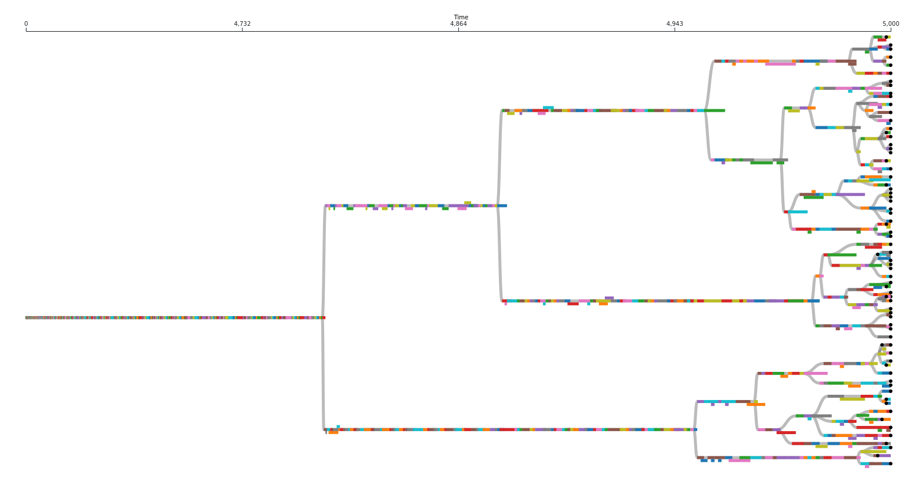

# phylotrackpy: a python phylogeny tracker

[](https://joss.theoj.org/papers/efbcc9a16833768672ac4b0b641018c6)
[](https://github.com/emilydolson/python-phylogeny-tracker/actions/workflows/ci.yml)
[](https://phylotrackpy.readthedocs.io/en/latest/?badge=latest)
[](https://pypi.python.org/pypi/phylotrackpy)


In _in silico_ evolution experiments, we have the luxury of being able to perfectly track the phylogenies of our populations, rather than having to just infer them after the fact. Phylotrackpy is a Python package designed to help you do so as efficiently as possible.


At face value, measuring a phylogeny in *in silico* evolution may seem very straightforward: you just need to keep track of what gives birth to what. However, multiple aspects turn out to be non-trivial. The goal of Phylotrackpy is to implement these things the right way once so that we all can stop needing to re-implement them over and over. Phylotrackpy is a python library designed to flexibly handle all aspects of recording phylogenies in *in silico* evolution.

Note: this library is essentially a wrapper around [Phylotracklib](https://empirical--466.org.readthedocs.build/en/466/library/Evolve/systematics.html), which is implemented in C++. If you need a C++ phylogeny tracker, you can use that one directly (it is part of the larger Empirical library, which is header-only so you can just include the parts you want).

## Features

- [**Pruning**](https://phylotrackpy.readthedocs.io/en/latest/#pruning): Ability to prune out taxa that are extinct and have no extant descendants (to keep memory use under control)
- [**Flexible taxon definitions**](https://phylotrackpy.readthedocs.io/en/latest/#flexible-taxon-definitions): Flexible control of how taxa are defined (e.g. by genotype, by phenotype, by trait, or by something more complex)
- [**Efficiency**](https://phylotrackpy.readthedocs.io/en/latest/#efficiency): Highly efficient (implemented in C++ under the hood)
- [**Phylostatistics**](https://phylotrackpy.readthedocs.io/en/latest/#phylostatistics-calculations): Includes various phylogenetic topology metrics
- [**Flexible output**](https://phylotrackpy.readthedocs.io/en/latest/#flexible-output-options): Easily add columns to output files.

## High level usage

There are three main steps in using phylotrackpy:

- [Construct a `Systematics` object](https://phylotrackpy.readthedocs.io/en/latest/#creating-a-systematics-object)
- [Notify the systematics object whenever anything is born](https://phylotrackpy.readthedocs.io/en/latest/#notifying-the-systematics-object-of-births)
- [Notify the systematics object whenever anything dies](https://phylotrackpy.readthedocs.io/en/latest/#notifying-the-systematics-object-of-deaths)

For more detailed instructions, see the [documentation](https://phylotrackpy.readthedocs.io/en/latest/)

## Installation

Phylotrackpy is available through pip:

```bash
pip install phylotrackpy
```

## Useful background information

There are certain quirks associated with real-time phylogenies (especially digital ones) that you might not be used to thinking about if you're used to dealing with reconstructed phylogenies. Many of these discrepancies are the result of the very different temporal resolutions on which these types of phylogenies are measured, and the fact that the taxonomic units we work with are often at a finer resolution than species. We document some here so that they don't catch you off guard:

- **Multifurcations are real**: In phylogenetic reconstructions, there is usually an assumption that any multifurcation/polytomy (i.e. a node that has more than two child nodes) is an artifact of having insufficient data. In real-time phylogenies, however, we often observe multifurcations that we know for sure actually happened.
- **Not all extant taxa are leaf nodes**: In phylogenetic reconstructions, there is usually an assumption that all extant (i.e. still living) taxa are leaf nodes in the phylogeny (i.e. none of them are parents/offspring of each other; similar taxa are descended from a shared common ancestor). In real-time phylogenies it is entirely possible that one taxon gives birth to something that we have defined as a different taxon and then continues to coexist with that child taxon.
- **Not all nodes are branch points**: In phylogenetic reconstructions, we only attempt to infer where branch points (i.e. common ancestors of multiple taxa) occurred. We do not try to infer how many taxa existed on a line of descent between a branch point and an extant taxa. In real-time phylogenies we observe exactly how many taxa exist on this line of descent and we keep a record of them. In practice there are often a lot of them, depending on you define your taxa. It is unclear whether we should include these non-branching nodes when calculating phylogenetic statistics (which is why Phylotrackpy lets you choose whether you want to).



The above image represents an actual phylogeny measured from digital evolution. Each rectangle represents a different taxon. It's position along the x axis represents the span of time it existed for. Note that there are often sections along a single branch where multiple taxa coexisted for a period of time. Circles represent extant taxa at the end of this run.

## Dependencies

- [pybind11](https://pybind11.readthedocs.io/en/stable/) (for wrapping C++ code into Python)
- [Empirical](https://github.com/devosoft/Empirical) (where the C++ version of this code lives)

### Testing dependencies

- pytest

### Documentation dependencies

- myst_parser (for writing documentation in markdown)
- sphinx_rtd_theme (theme for [readthedocs](https://readthedocs.org/))

## Contributing

Contributions are welcome! See [CONTRIBUTING.md](CONTRIBUTING.md).

## Developers

- [Emily Dolson](https://emilyldolson.com) (lead developer)
- [Matthew Andres Moreno](https://mmore500.com/)
