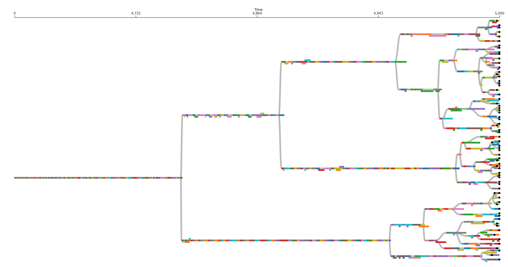

# Nuances of Exact Phylogenies

There are certain quirks associated with real-time phylogenies that you might not be used to thinking about if you're used to dealing with reconstructed phylogenies. Many of these discrepancies are the result of the very different temporal resolutions on which these types of phylogenies are measured, and the fact that the taxonomic units we work with are often at a finer resolution than species. We document some here so that they don't catch you off guard:

- **Multifurcations are real**: In phylogenetic reconstructions, there is usually an assumption that any {term}`multifurcation/polytomy` (i.e. a node that has more than two child nodes) is an artifact of having insufficient data. In real-time phylogenies, however, we often observe multifurcations that we know for sure actually happened.
- **Not all extant taxa are leaf nodes**: In phylogenetic reconstructions, there is usually an assumption that all extant (i.e. still living) {term}`taxa` are leaf nodes in the phylogeny (i.e. none of them are parents/offspring of each other; similar taxa are descended from a shared common ancestor). In real-time phylogenies it is entirely possible that one {term}`taxon` gives birth to something that we have defined as a different taxon and then continues to coexist with that child taxon.
- **Not all nodes are branch points**: In phylogenetic reconstructions, we only attempt to infer where branch points (i.e. common ancestors of multiple taxa) occurred. We do not try to infer how many {term}`taxa` existed on a line of descent between a branch point and an extant taxa. In real-time phylogenies we observe exactly how many taxa exist on this line of descent and we keep a record of them. In practice there are often a lot of them, depending on you define your taxa. It is unclear whether we should include these non-branching nodes when calculating phylogenetic statistics (which is why Phylotrackpy lets you choose whether you want to).

The above image represents an actual phylogeny measured from digital evolution. Each rectangle represents a different taxon. It's position along the x axis represents the span of time it existed for. Note that there are often sections along a single branch where multiple taxa coexisted for a period of time. Circles represent extant taxa at the end of this run.