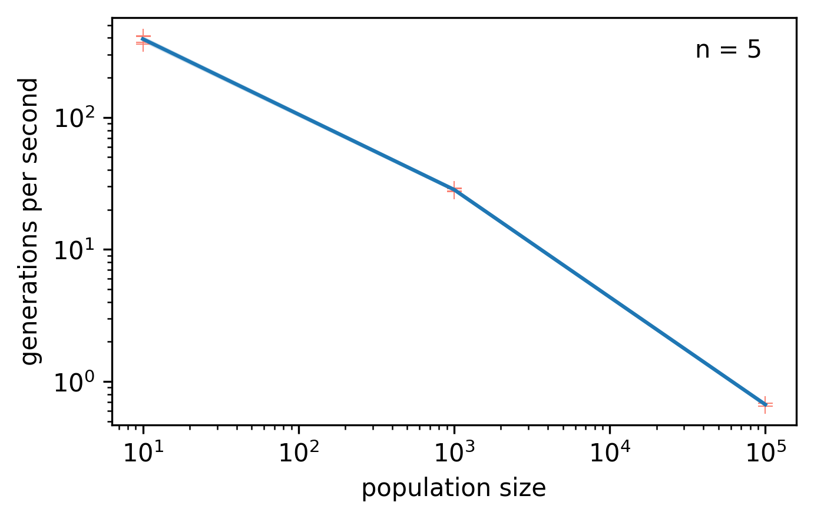
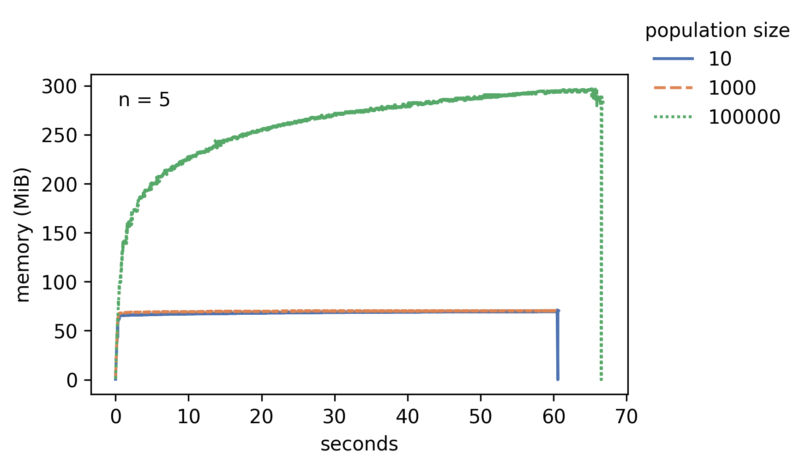

# Summary

*In silico* evolution instantiates the processes of heredity, variation, and differential reproductive success (the three "ingredients" for evolution by natural selection) within digital populations of computational agents.
Consequently, these populations undergo evolution [@pennock2007models], and can be used as virtual model systems for studying evolutionary dynamics.
This experimental paradigm --- used across biological modeling, artificial life, and evolutionary computation --- complements research done using *in vitro* and *in vivo* systems by enabling the user to conduct experiments that would be impossible in the lab or field [@dolsonDigitalEvolutionEcology2021].
One key benefit is complete, exact observability.
For example, it is possible to perfectly record the full set of parent-child relationships over the history of a population, yielding precise and accurate phylogenies (ancestry trees).
This information reveals the sequences of events behind gain, loss, or maintenance of specific traits, and also facilitates making inferences about the underlying evolutionary dynamics of a given system [mooers1997inferring;@dolsonInterpretingTapeLife2020;@moreno2023toward].

The Phylotrack project provides libraries for tracking and analyzing phylogenies in *in silico* evolution.
The project is composed of 1) Phylotracklib: a header-only C++ library, developed under the umbrella of the Empirical project [@ofria2020empirical], and 2) Phylotrackpy: a Python wrapper around Phylotracklib, created with Pybind11 [@pybind11].
Both components supply a public-facing API to attach phylogenetic tracking to digital evolution systems, as well as a stand-alone interface for measuring a variety of popular phylogenetic topology metrics [@tuckerGuidePhylogeneticMetrics2017].
The underlying algorithm design prioritizes efficiency, allowing Phylotrack to support agent populations numbering in the tens of thousands with rapid generational turnover.
The underlying C++ implementation ensures fast, memory-efficient performance, with multiple explicit features (e.g., phylogeny pruning and abstraction, etc.) for reducing the memory footprint of phylogenetic information.

# Statement of Need

<!-- was going to say a rich history of sophisticated phylogenetic analyses... -->
*In silico* evolution work enjoys a rich history of phylogenetic measurement and analysis, and many systems facilitate tracking phylogenies [@ray1992evolution;@ofria2004avida;@bohm2017mabe;@de2012deap;@Garwood_REvoSim_Organism-level_simulation_2019].
However, to our knowledge, no other general-purpose perfect phylogeny tracking library exists; prior work has used bespoke system- or framework-specific implementations.
In contrast, Phylotrack provides ready-built tracking flexible enough to attach to any population of digital replicating entities.

Two other general-purpose libraries for phylogenetic record-keeping do exist: hstrat and Automated Phylogeny Over Geological Timescales (APOGeT).
However, they provide different modes of phylogenetic instrumentation than Phylotrack does.
Whereas Phylotrack uses a graph-based approach to perfectly record asexual phylogenies, the hstrat library implements hereditary stratigraphy, a recently developed method that allows robust decentralized phylogenetic tracking in parallel and distributed systems at the cost of a tunable reduction in accuracy [@moreno2022hstrat] (see  [@moreno2023lineage] for a more thorough comparison).
APOGeT, in turn, focuses on tracking speciation in sexually-reproducing populations [@godin2019apoget].

Vast amounts of bioinformatics-oriented phylogenetics software is also available.
These programs' purposes typically include
- inferring phylogenies from extant organisms (and sometimes fossils) [@challa2019phylogenetic],
- sampling phylogenies from theoretical models of population and species dynamics [@stadler2011simulating],
- cross-referencing phylogenies with other data (e.g., spatial species distributions) [@emerson2008phylogenetic], and
- analyzing and manipulating tree structures [@smith2020treedist;@sand2014tqdist;@sukumaran2010dendropy;@cock2009biopython].

Phylotrack overlaps with these goals only in that it also provides tree statistic implementations. We chose to include this feature to facilitate fast during-simulation calculations of these metrics.
Notably, the problem of tracking a phylogeny within an agent-based program is substantially different from the more traditional problem of reconstructing a phylogeny.
Users new to working with recorded phylogenies should refer to the Phylotrackpy documentation for notes on subtle structural differences from reconstructed phylogenies.

Phylotrack has contributed to a variety of published research projects.
Phylotracklib has been integrated into packages such as Modular Agent-Based Evolver (MABE) 2.0 [@bohm2019mabe], Symbulation [@vostinarSpatialStructureCan2019], and even a fork of the Avida digital evolution platform [@ofria2004avida;@dolsonInterpretingTapeLife2020].
Through these integrations, Phylotracklib has enabled research on open-ended evolution [@dolsonMODESToolboxMeasurements2019], the origin of endosymbiosis [@johnsonEndosymbiosisBustInfluence2022a], the importance of phylogenetic diversity for machine learning via evolutionary computation [@hernandez2022can;@shahbandegan2022untangling], and more.
Phylotrackpy is newer, but it has already served as a point of comparison in the development of other phylogenetic tools [@moreno2022hereditary;@moreno2023toward].

# Features

__Lineage Recording:__
The core functionality of Phylotrack is recording asexual phylogenies. To achieve this goal, Phylotrack need only be notified of each agent creation and destruction event.
To reduce memory overhead, extinct branches are pruned from phylogenies by default, but this feature can be disabled.
The level of abstraction (i.e. what constitutes a taxonomic unit) can be customized via a user-provided function.
Supplemental data about each taxonomic unit can be stored efficiently.

Lineage recording in phylotrackpy is efficient.
The worst-case time complexity is O(1) [@moreno2023lineage].
Space complexity is harder to meaningfully calculate, but should be O(N) on average in most evolutionary scenarios (where N is population size)  [@moreno2023lineage].

__Serialization:__
Phylotrack outputs data in the Artificial Life Standard Phylogeny format [@lalejiniDataStandardsArtificial2019] to facilitate interoperability with an associated ecosystem of software converters, analyzers, visualizers.
As these tools support conversion to bioinformatics-standard formats (e.g., Newick, phyloXML, etc.), Phylotrack phylogenies can also be analyzed with tools designed for biological data.
Phylogeny data can be restored from file, enabling post-hoc calculation of phylogenetic topology statistics.

__Phylogenetic Topology Statistics:__ Support is provided for
- Average phylogenetic depth across taxa
- Average origin time across taxa
- Most recent common ancestor origin time
- Shannon diversity [@spellerberg2003tribute]
- Colless-like index [@mirSoundCollesslikeBalance2018]
- Mean, sum, and variance of evolutionary distinctiveness [@isaacMammalsEDGEConservation2007;@tuckerGuidePhylogeneticMetrics2017]
- Mean, sum, and variance pairwise distance [@clarkeQuantifyingStructuralRedundancy1998;@clarkeFurtherBiodiversityIndex2001;@webbPhylogeniesCommunityEcology2002;@tuckerGuidePhylogeneticMetrics2017]
- Phylogenetic diversity [@faithConservationEvaluationPhylogenetic1992]
- Sackin's index [@shao1990tree]

# Profiling

This section reports *in situ* runtime performance characteristics of the PhylotrackPy library.
To measure PhylotrackPy in action, we ran a simple asexual evolutionary algorithm instrumented with systematics tracking.
Genotypes consisted of single floating point values.
We performed neutral selection, with 20\% of offspring mutated each generation.
The string representation of genotypes served as the taxonomic unit for systematics tracking.

We tested population sizes 10 ($10^3$), 1,000 ($10^3$), and 100,000 ($10^5$).
Tests evaluated 60 second execution windows, with five replicates performed for each configured population size.
Each trial concluded with a `snapshot` operation to serialize tracked records to file.

Experiment trials used following system specifications:

- Operating System: Fedora Linux 38 (Workstation Edition) x86_64
- Machine: ThinkPad X1 Carbon Gen 8
- Processor: Intel i7-10510U (8 cores) @ 4.900GHz
- Memory: 16GB DRAM

We used and the `memory_profiler` library v0.61.0 to measure process memory usage (via the `psutil` backend) and the built-in `time` module to measure elapsed time [@memory_profiler].
Profiling data can be accessed via the Open Science Framework at <https://osf.io/52hzs/> [@foster2017open].
Profiling scripts can be found in the PhylotrackPy module under the `profile/` directory.

## Execution Speed

{ width=50% }

Figure \ref{fig:memory} shows generations evaluated per second for each tested popultion size.At population size 10, 3,923 (s.d. 257) agent evaluations were processed per second (generations per second times population size).
Population size 1,000 elapsed 28,386 (s.d. 741) agent evaluations per second and population size 100,000 elapsed 67,000 (s.d. 1825).
Enhancement in agent evaluation efficiency likely arose from more effective exploitation of NumPy vectorized operations over the non-phylotrack evolutionary algorithm components.

## Memory Usage

{ width=50% }

With extinct lineage pruning, PhylotrackPy consumes 296 MiB (s.d. 1.1 MiB) peak memory to track a population of 100,000 over the 40 (s.d. 1) generations elapsed during the 60 second execution window.
Peak memory usage is 70.6 MiB (s.d. 0.5) at population size 10 and 71.0 MiB (s.d. 0.2) at population size 1,000.
Figure \ref{fig:memory} shows memory use trajectories over 60 second evaluation windows for each tested population size.

In most tracking applications, memory usage should be expected somewhat lower because selection typically accelerates coalescence, affording more opportunities for lineage pruning.

# Future Work

The primary current limitation of Phylotrack is its incompatibility with sexually-reproducing populations (unless tracking is done per-gene).
We plan to extend Phylotrack in a future release to allow multiple parents per taxon.

# Acknowledgements

This research was supported in part by Michigan State University through the computational resources provided by the Institute for Cyber-Enabled Research.

# References

\pagebreak
\appendix
