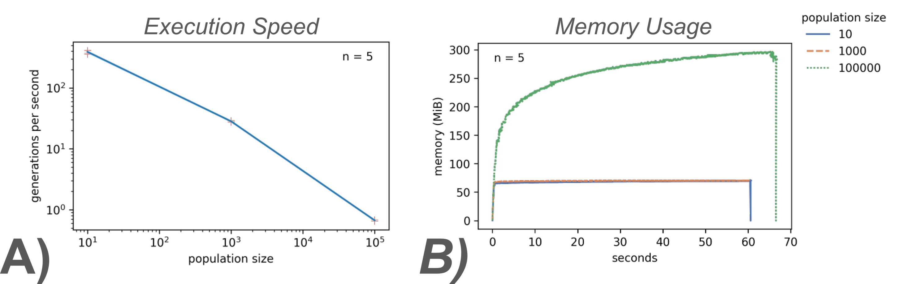

# Summary

*In silico* evolution instantiates the processes of heredity, variation, and differential reproductive success (the three "ingredients" for evolution by natural selection) within digital populations of computational agents.
Consequently, these populations undergo evolution [@pennock2007models], and can be used as virtual model systems for studying evolutionary dynamics.
This experimental paradigm --- used across biological modeling, artificial life, and evolutionary computation --- complements research done using *in vitro* and *in vivo* systems by enabling experiments that would be impossible in the lab or field [@dolsonDigitalEvolutionEcology2021].
Although visibility into *in vivo* systems is growing ever more fine-grained [@konno2022deep], complete, exact observability remains a key benefit of computational methods.
For example, it is possible to perfectly record all parent-child relationships across simulation history, yielding complete phylogenies (ancestry trees).
This information reveals when traits were gained or lost, and also facilitates inference of underlying evolutionary dynamics [@mooers1997inferring;@dolsonInterpretingTapeLife2020;@moreno2024ecology].

The Phylotrack project provides libraries for tracking and analyzing phylogenies in *in silico* evolution.
The project is composed of 1) Phylotracklib: a header-only C++ library, developed under the umbrella of the Empirical project [@ofria2020empirical], and 2) Phylotrackpy: a Python wrapper around Phylotracklib, created with Pybind11 [@pybind11].
Both components supply a public-facing API to attach phylogenetic tracking to digital evolution systems, as well as a stand-alone interface for measuring a variety of popular phylogenetic topology metrics [@tuckerGuidePhylogeneticMetrics2017].
Underlying design and C++ implementation prioritize efficiency, allowing for fast generational turnover for agent populations numbering in the tens of thousands.
Several explicit features (e.g., phylogeny pruning and abstraction, etc.) are provided to reduce the memory footprint of phylogenetic information.

# Statement of Need

*In silico* evolution work enjoys a rich history of phylogenetic measurement and analysis, and many systems facilitate tracking phylogenies [@ray1992evolution;@ofria2004avida;@bohm2017mabe;@de2012deap;@Garwood_REvoSim_Organism-level_simulation_2019].
In particular, the bioinformatics community has fielded a rich set of agent-based, forward-time simulation frameworks capable of reporting evolutionary history.
These include Nemo [@Guillaume2006], TreeSimJ [@OFallon2010], fwdpp [@Thornton2014], sPEGG [@okamoto2017framework], MimicrEE2 [@Vlachos2018],  hexsim [@schumaker2018hexsim], SimBit [@MattheyDoret2021], and SLiM [@haller2023slim].
SLiM is a popular --- and powerful --- exemplar of the framework-oriented approach.
Simulations are highly configurable, owing to inclusion of an inbuilt scripting language [@haller2016eidos], yet still ultimately must take place within SLiM's tick cycle and community-species-subpopulation ontology.
Such an approach enables highly optimized operation and reduces end-user workload.
In contrast, Phylotrack provides ready-built tracking flexible enough to attach to any population of digital replicating entities, however implemented or organized.
To our knowledge, no other general-purpose phylogeny tracking library currently exists, as prior work has relied on bespoke system- or framework-specific implementations.

Two other general-purpose libraries for phylogenetic record-keeping do exist: hstrat and Automated Phylogeny Over Geological Timescales (APOGeT).
However, they provide different modes of phylogenetic instrumentation than Phylotrack does.
Whereas Phylotrack uses a graph-based approach to perfectly record asexual phylogenies, the hstrat library implements hereditary stratigraphy, a technique for decentralized phylogenetic tracking that is approximate instead of exact [@moreno2022hstrat] (see [@moreno2024analysis] for a more thorough comparison).
APOGeT, in turn, focuses on tracking speciation in sexually reproducing populations [@godin2019apoget].

Vast amounts of bioinformatics-oriented phylogenetic analysis software is also available.
Applications typically include

- inferring phylogenies from extant organisms (and sometimes fossils) [@challa2019phylogenetic],
- sampling phylogenies from theoretical models of population and species dynamics [@stadler2011simulating],
- cross-referencing phylogenies with other data (e.g., spatial species distributions) [@emerson2008phylogenetic], and
- analyzing and manipulating tree structures [@smith2020treedist;@sand2014tqdist;@sukumaran2010dendropy;@cock2009biopython].

Phylotrack overlaps with these goals only in that it also provides tree statistic implementations.
We chose to include this feature to facilitate fast during-simulation calculations of these metrics.
Notably, the problem of tracking a phylogeny within an agent-based program differs substantially from the more traditional problem of reconstructing a phylogeny.
Users new to recorded phylogenies should refer to the Phylotrackpy documentation[^1] for notes on subtle structural differences from reconstructed phylogenies.

[^1]: Phlotrack documentation is hosted via ReadTheDocs at [https://phylotrackpy.readthedocs.io/](https://phylotrackpy.readthedocs.io/).

Phylotrack has contributed to a variety of published research projects through integrations with Modular Agent-Based Evolver (MABE) 2.0 [@bohm2019mabe], Symbulation [@vostinarSpatialStructureCan2019], and even a fork of the Avida digital evolution platform [@ofria2004avida;@dolsonInterpretingTapeLife2020].
Research topics include open-ended evolution [@dolsonMODESToolboxMeasurements2019], the origin of endosymbiosis [@johnsonEndosymbiosisBustInfluence2022a], the importance of phylogenetic diversity for machine learning via evolutionary computation [@hernandez2022can;@shahbandegan2022untangling], and more.
Phylotrackpy is newer, but it has already served as a point of comparison in the development of other phylogenetic tools [@moreno2022hereditary;@moreno2023toward].

# Features

{ width=70% }

__Lineage Recording:__
The core functionality of Phylotrack is to record asexual phylogenies from simulation agent creation and destruction events.
To improve memory efficiency, extinct branches are pruned from phylogenies by default, but this feature can be disabled.
Further efficiency can be gained by coarsening the level of abstraction applied (i.e., what constitutes a taxonomic unit).
Configurability of the operational taxonomic unit, in addition, helps users collect data that matches their experimental objectives.
For instance, recent work on phylometric signals of evolutionary conditions found substantial qualitative differences in phylometrics collected from individual- versus genotype-level tracking [@moreno2024ecology].
Supplemental data about each taxonomic unit can be stored efficiently.

Figure \ref{fig:schematic} overviews Phylotrack's two core operations: taxon creation and removal.
On simulation startup, end-users report founding agents to Phylotrack.
Each is assigned a Taxon ID.
Subsequently, as shown in Figure \ref{fig:schematic}a, user code informs Phylotrack of simulation reproduction events as they occur.
Given (1) the parent's Taxon ID and (2) the offspring's taxonomic traits (e.g., genome for genotype-level tracking, trait vector for phenotype-level tracking, etc.), Phylotrack returns a Taxon ID for the offspring.
If the offspring's taxonomic traits match its parent, their Taxon ID will be identical; otherwise, Phylotrack assigns the offspring a new Taxon ID.
Figure \ref{fig:schematic}b shows the other primary Phylotrack operation, taxon removal.
Each time simulation discards an agent, user code reports its Taxon ID to Phylotrack.
If no extant agents carry that Taxon ID and the Taxon ID has no extant descendants, Phylotrack deletes corresponding lineage records to reclaim memory.
(However, depending on user objectives, this feature can be disabled to retain complete phylogenetic history.)

Lineage recording in Phylotrack is efficient.
The worst-case time complexity of taxon creation is O(1) with respect to both population size and generations elapsed [@moreno2024analysis].
In pruning-enabled tracking, taxon removal is amortized O(1).
Space complexity is harder to calculate meaningfully, but should be O(N) on average in most evolutionary scenarios (where N is population size).
For details, refer to @moreno2024analysis.

__Serialization:__
Phylotrack exports data in the Artificial Life Standard Phylogeny format [@lalejiniDataStandardsArtificial2019].
This format integrates with an associated ecosystem of software converters, analyzers, and visualizers.
Existing tools support easy conversion to bioinformatics-standard formats (e.g., Newick, phyloXML, etc.) [@moreno2024apc], allowing Phylotrack phylogenies to be analyzed with tools designed for biological data.
Phylogeny data can be restored from file, enabling post-hoc calculation of phylogenetic topology statistics.

__Phylogenetic Topology Statistics:__ Support is provided for

- Average phylogenetic depth across taxa
- Average origin time across taxa
- Most recent common ancestor origin time
- Shannon diversity [@spellerberg2003tribute]
- Colless-like index [@mirSoundCollesslikeBalance2018]
- Mean, sum, and variance of evolutionary distinctiveness [@isaacMammalsEDGEConservation2007;@tuckerGuidePhylogeneticMetrics2017]
- Mean, sum, and variance pairwise distance [@clarkeQuantifyingStructuralRedundancy1998;@clarkeFurtherBiodiversityIndex2001;@webbPhylogeniesCommunityEcology2002;@tuckerGuidePhylogeneticMetrics2017]
- Phylogenetic diversity [@faithConservationEvaluationPhylogenetic1992]
- Sackin's index [@shao1990tree]

# Profiling

To assess Phylotrack performance, we ran a simple asexual evolutionary algorithm instrumented with lineage-pruned systematics tracking.
We performed neutral selection with a 20\% mutation probability.
Genomes consisted of a single floating-point value, which also served as the taxonomic unit.

We ran 60-second trials using population sizes 10, 1,000, and 100,000, with five replicates each.
Each trial concluded with a data export operation.
We used `memory_profiler` (`psutil` backend) to measure process memory usage [@memory_profiler].
Full profiling data and hardware specifications hosted via the Open Science Framework at <https://osf.io/52hzs/> [@foster2017open].

{ width=100% }

## Execution Speed

Figure \ref{fig:profiling}a shows generations evaluated per second at each population size.
At population size 10, 1,000, and 100,000, we observed 3,923 (s.d. 257), 28,386 (s.d. 741), and 67,000 (s.d. 1,825) agent reproduction events per second.
Efficiency gains with population size likely arose from NumPy vectorized operations used to perform mutation and selection.

## Memory Usage

Phylotrack consumes 296 MiB (s.d. 1.1) peak memory to track a population of 100,000 agents over 40 (s.d. 1) generations.
At population sizes 10 and 1,000, peak memory usage was 70.6 MiB (s.d. 0.5) and 71.0 MiB (s.d. 0.2).
Figure \ref{fig:memory}b shows memory use trajectories over 60-second trials.

Most applications should expect lower memory usage because selection typically increases opportunities for lineage pruning.

# Availability and Implementation

Phylotrackpy's source code is open source at [https://github.com/emilydolson/phylotrackpy](https://github.com/emilydolson/phylotrackpy).
It is provided under the MIT License.
Installation --- including cross-platform precompiled wheel files --- can be performed via PyPI.[^2]
To ensure perpetual availability, PhylotrackPy and its C++ backend are archived via Zenodo [@ofria2020empirical; @dolson2024phylotrackpy].

[^2]: Phylotrack's PyPI package listing is at [https://pypi.org/project/phylotrackpy/](https://pypi.org/project/phylotrackpy/).

# Conclusion

Agent-based, forward-time modeling has an important role to play in integrating and extending our understanding of natural systems [@Urban2021; @Marshall2014].
Phylotrack seeks to complement the rich collection of existing framework-oriented agent-based simulation systems by providing a library tool that empowers Python and C++ users to extract evolutionary history from fully custom projects.
Such an approach, in particular, supports end-user work that also leverages other tools from the Python package ecosystem [@Perez2011; @Raschka2020] and reaches a broad, diverse audience of Python users [@Perkel2015].
Our ultimate goal in releasing this software is to better bring bioinformatics to bear in digital evolution experiments, and to better recruit digital evolution in generating synthetic data that supports bioinformatics work [@Sukumaran2021].

In future work, we plan to extend Phylotrack in a future release to allow multiple parents per taxon.
A current limitation of Phylotrack is incompatibility with sexually reproducing populations (unless tracking is per gene).
We also look forward to expanding Phylotrack's portfolio of natively-implemented phylogeny structure metrics.

# Acknowledgements

This research was supported in part by Michigan State University through the computational resources provided by the Institute for Cyber-Enabled Research.
This research is based upon work supported by the Eric and Wendy Schmidt AI in Science Postdoctoral Fellowship, a Schmidt Futures program.

# References

\pagebreak
\appendix
